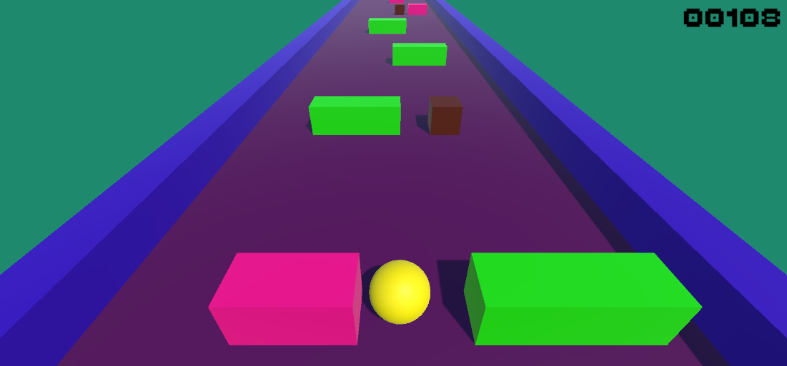

# 🎮 Avoid

## 📌 Description
**Avoid** is a **pre-prosthetic serious game** developed in **Unity**, controlled through the **Myo Armband**.  
It is specially designed for **people with upper limb amputation**, helping them train their **residual muscle signals** before using a myoelectric prosthesis.  

The main goal of the game is to **dodge obstacles** along an endless track, while promoting **motor coordination, muscle training, and rehabilitation**.

---

## 🕹️ Gameplay Mechanics
- The player controls a **yellow sphere** that moves sideways.  
- Movements are performed exclusively using **muscle contractions of flexion and extension**, captured by the **Myo Armband**.  
- The objective is to **avoid collisions** with colored blocks that appear on the track.  
- The score increases as the player survives longer.  

---

## 🖼️ Game Example
Figure 1 - Avoid

Source: Author.

---

## ⚙️ Technologies Used
- **Unity Engine** (game development)  
- **Myo Armband** (flexion and extension EMG signal recognition)  
- **Python** (training the machine learning model and processing EMG signals)  
- **C#** (game logic and integration)  

---

## 🤖 Machine Learning Model
- The **Myo Armband** captures **EMG (electromyographic) signals** from the residual limb.  
- A **Python-based model** is trained to detect **flexion and extension** patterns.  
- After training, the processed signals are transmitted in **real-time** to Unity.  
- This enables **pre-prosthetic training**, preparing amputees for the control of **myoelectric prostheses**.  

---

## 🎯 Project Purpose
**Avoid** was created as a **serious pre-prosthetic game** with the following goals:  
- Support **people with upper limb amputation** in training EMG-based control.  
- Provide an engaging environment for **pre-prosthetic rehabilitation**.  
- Improve **motor coordination, muscle strength, and reaction time**.  
- Serve as a complementary tool in **physiotherapy and rehabilitation programs**.  

---

## 🚀 How to Play
1. Wear the **Myo Armband** on the residual limb or the healthy arm.  
2. Run the **Python script** to capture and classify **flexion and extension muscle contractions**.  
3. The trained model sends EMG data to **Unity** in real time.  
4. Control the **yellow sphere** by contracting muscles for **flexion or extension** to dodge the blocks.  
5. Survive as long as possible and achieve the highest score.  
